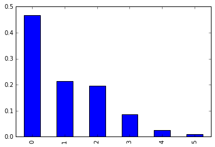
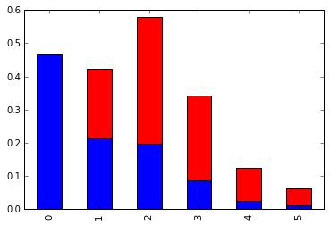
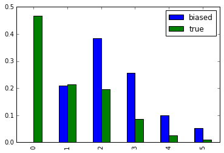

[Think Stats Chapter 3 Exercise 1](http://greenteapress.com/thinkstats2/html/thinkstats2004.html#toc31) (actual vs. biased)

```
import matplotlib.pyplot as plt
import pandas as pd

pmf = resp.numkdhh.value_counts().sort_index()/resp.numkdhh.size
pmf.plot(kind='bar')

def BiasPmf(pmf, label=''):
    total = 0
    weighted = pmf.copy()
    for k,v in weighted.iteritems():
        weighted[k] = (k*v)
        total += weighted[k]
# normalize sum of probabilities to 1
    for k,v in weighted.iteritems():
        weighted[k] /= total
        
    return weighted
    
def df_avg(df):
    avg = 0
    for i in df.index:
        avg += i * df[i]
    return avg
    

biased = BiasPmf(pmf)

pmf.plot(kind='bar')
biased.plot(kind='bar', color='r', stacked='True', bottom=pmf)
pmfs = pd.DataFrame({'true':pmf,'biased':biased})
pmfs.plot(kind='bar')

print df_avg(pmf)
print df_avg(biased)

```
# Results:





Averages:
true: 1.02420515504
biased: 2.403679100664


