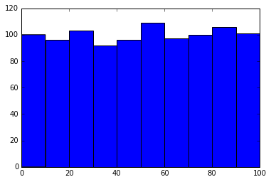
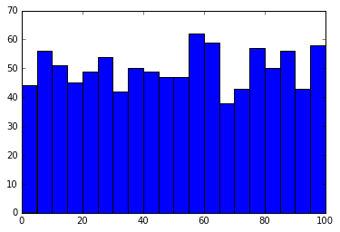
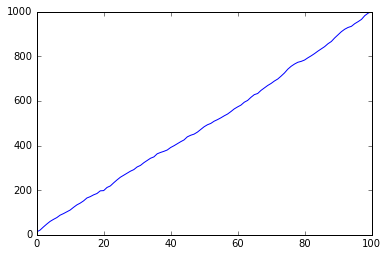

[Think Stats Chapter 4 Exercise 2](http://greenteapress.com/thinkstats2/html/thinkstats2005.html#toc41) (a random distribution)

```
import random
import matplotlib.pyplot as plt
import math
%matplotlib inline

rands = [random.randint(0,100) for i in range(0,1000)]
plt.hist(rands, bins=10)
plt.show()

from collections import Counter
counts = Counter(rands)
pmf = [counts[i] for i in range(0,101)]
cdf = [pmf[0]]
for i in range(1,101):
    cdf.append(cdf[i-1]+pmf[i])
plt.plot(cdf)
```

# Results:
Yes, they seem to be random and uniformly distributed. As expected, the plot of the cdf is nearly a straight diagonal line.




